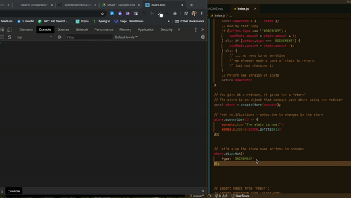

## Intro to Redux

To demonstrate how Redux works, we'll build a simple counter app

When working with redux:
1. State *describe the ideal version of state*

```javascript
{
    amount: 100
}
```

If we  add 1 to the amount, what would state look like?

```javascript
{
    amount: 101
}
```

2. Action 


```javascript
{
    type: 'INCREMENT'
}
```

```javascript
{
    type: 'DECREMENT'
}
```

```javascript
{
    type: '😎'
}
```


3. Reducer funtion *reducers are always named for the state they manage*
- Redux will always give your reducers two things: current state + the action they're processing
- They *must* return the new version of state 

```javascript
function counter(state, action) {
    // make a copy of state 
    const newState = { ...state };
    // modify that copy 
    if (action.type === 'INCREMENT') {
        newState.amount = state.amount + 1;
    } else if (action.type === 'DECREMENT') {
        newState.amount === state.amount -1;
    } else {
        // ... no need to do anything 
        // we already made a copy of state to return, 
        // just not changing it 
    }
    // return new version of state 
    return newState;
}
```

```npm i redux```

You give it a reducer, it gives you a store. A store is an object that manages your state using a reducer 

```javascript 
const store = createStore(counter); 
```
4. "Push notifications" - subscribe to changes in the store 
```javascript
store.subscribe(() => {
    console.log(`The state is now:`);
    console.table(store.getState());
}); 
```

Let's give the store some actions to process 
```javascript
store.dispatch({
    // hand it an action object
    type: 'INCREMENT', 
});
```

Dispatches a couple more changes and confirms that state changes correctly!




