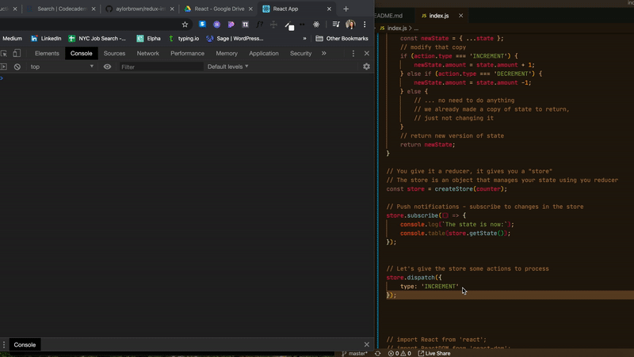

## Intro to Redux

To demonstrate how Redux works, we'll build a simple counter app

When working with Redux:
### State *describe the ideal version of state*

```javascript
{
    amount: 100
}
```

If we  add 1 to the amount, what would state look like?

```javascript
{
    amount: 101
}
```

### Action 

```javascript
{
    type: 'INCREMENT'
}
```

```javascript
{
    type: 'DECREMENT'
}
```

```javascript
{
    type: '😎'
}
```


### Reducer function *reducers are always named for the state they manage*
- Redux will always give your reducers two things: current state + the action they're processing
- They *must* return the new version of state 

```javascript
function counter(state, action) {
    // make a copy of state 
    const newState = { ...state };
    // modify that copy 
    if (action.type === 'INCREMENT') {
        newState.amount = state.amount + 1;
    } else if (action.type === 'DECREMENT') {
        newState.amount === state.amount -1;
    } else {
        // ... no need to do anything 
        // we already made a copy of state to return, 
        // just not changing it 
    }
    // return new version of state 
    return newState;
}
```

```npm i redux```

then 

```javascript 
import {
    createStore
} from 'redux';
```


You give it a reducer, it gives you a store. A store is an object that manages your state using a reducer 

```javascript 
const store = createStore(counter); 
```
4. "Push notifications" - subscribe to changes in the store 
```javascript
store.subscribe(() => {
    console.log(`The state is now:`);
    console.table(store.getState());
}); 
```

Let's give the store some actions to process 

```javascript
store.dispatch({
    // hand it an action object
    type: 'INCREMENT', 
});
```

Dispatches a couple more changes and confirms that state changes correctly!




### What if you want to change the state so you can specify an amount?
- Change the action! 

```javascript
store.dispatch({
    type: 'INCREMENT', 
    amount: 5
});
```

then also change the 1 in the counter function to ```action.amount```


### Switch/Case

You can replace if/elseif/else with switch/case:

```javascript
switch(action.type) {
    case 'INCREMENT':
        newState.amount = state.amount + action.amount;
        break;
    case 'DECREMENT':
        newState.amount = state.amount - action.amount;
        break;
    default:
        break;
    }
```

so pretty! 


### Stylistic things that will help you out later:

1. Define your actions as constant (because you'll have typos eventually)

```javascript
const INCREMENT = 'INCREMENT';
const DECREMENT = 'DECREMENT';
```

then use the const anywhere you want to refer to that action type!

2. Write action creator functions. They format your action objects. Again, to avoid typos 

```javascript 
function actionIncrement() {
    return {
        type: INCREMENT, 
        amount: 5
    }
}
```

```javascript
store.dispatch(actionIncrement());
```

### How do you configure how much to increment/decrement?

add ```howMuch``` as an argument to actionIncrement

```javascript
function actionIncrement(howMuch) {
    return {
        type: INCREMENT, 
        amount: howMuch
    }
}
```
and pass a number in your dispatch 

```javascript
store.dispatch(actionIncrement(5));
```


### What if you want to make it so that if action creators don't pass a value, it will use the value 1?

Pass a default value of 1 to the argument ```howMuch```

```javascript
function actionIncrement(howMuch=1) {
    return {
        type: INCREMENT, 
        amount: howMuch
    }
}
```

```store.dispatch(actionIncrement());```
will return 1 


